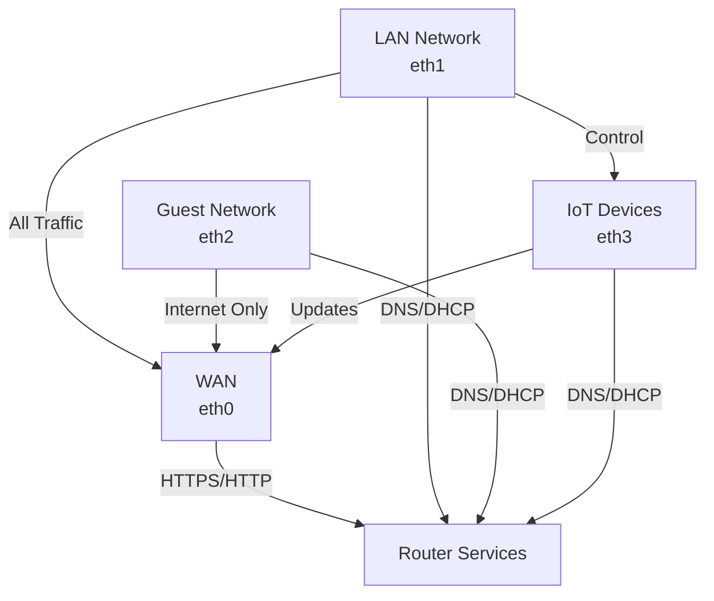
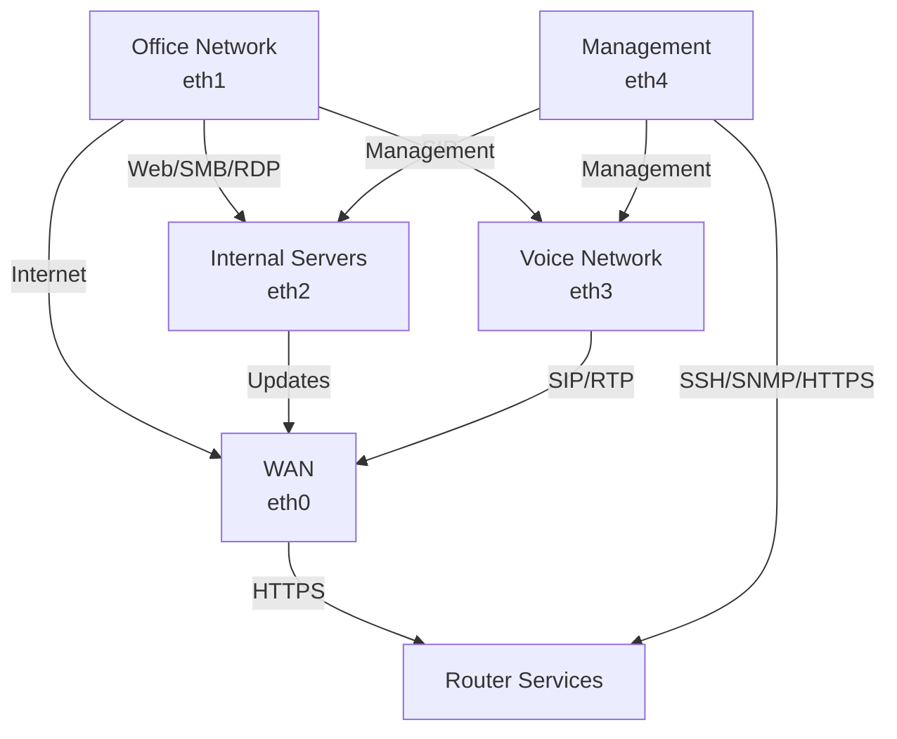
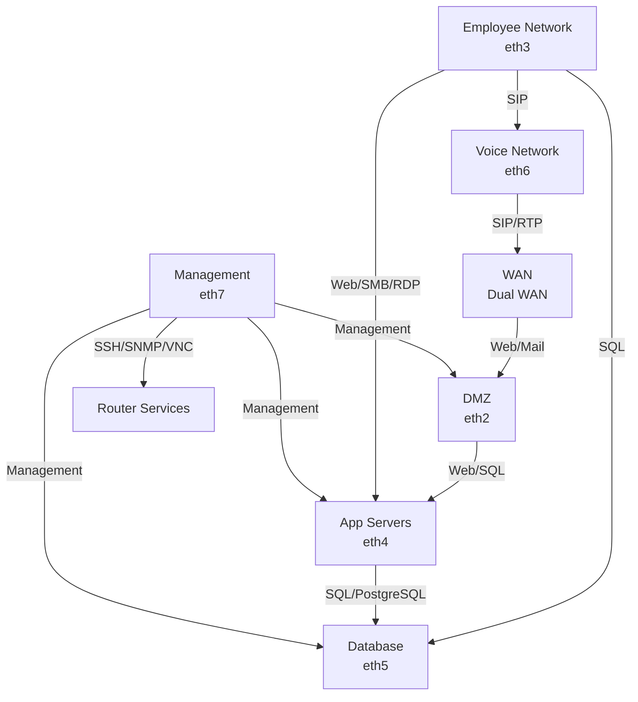

# Network Zone Configuration Examples

This document outlines three common network zone configurations for different environments: Home, SOHO (Small Office/Home Office), and Enterprise. Each configuration demonstrates best practices for network segmentation and security.

## Table of Contents
- [Home Network Configuration](#home-network-configuration)
- [SOHO Network Configuration](#soho-network-configuration)
- [Enterprise Network Configuration](#enterprise-network-configuration)

## Home Network Configuration

The home network configuration provides a basic but secure setup for residential use, separating different types of devices and traffic.

### Zone Structure

### Features
- **WAN Zone**: Internet connectivity through eth0
  - Limited access to router management
- **LAN Zone**: Main home network
  - Full internet access
  - Access to IoT devices
  - Basic network services (DNS, DHCP)
- **Guest Zone**: Isolated network for visitors
  - Internet access only
  - No access to internal resources
- **IoT Zone**: Dedicated network for smart devices
  - Internet access for updates
  - Protected from guest network
- **Local Zone**: Router services
  - Provides DNS and DHCP
  - Network management interface

## SOHO Network Configuration

The SOHO configuration balances security with ease of use, suitable for small businesses.

### Zone Structure

### Features
- **WAN Zone**: Internet connectivity
  - Secure HTTPS management only
- **Office Zone**: Workstation network
  - Access to internal servers
  - VoIP services
  - Full internet access
- **Servers Zone**: Internal services
  - Controlled internet access
  - Protected from direct WAN access
- **VoIP Zone**: Voice communications
  - SIP and RTP traffic
  - Quality of Service support
- **Management Zone**: Administrative access
  - Secure access to all zones
  - Network monitoring and control

## Enterprise Network Configuration

The enterprise configuration provides comprehensive segmentation for large organizations.

### Zone Structure

### Features
- **WAN Zone**: Dual internet connectivity
  - Redundant connections
  - Load balancing capability
- **DMZ Zone**: Public-facing services
  - Web servers
  - Mail servers
  - Protected from internal network
- **Internal Zone**: Employee network
  - Access to business applications
  - Database connectivity
  - VoIP services
- **Servers Zone**: Application servers
  - Controlled database access
  - Protected from direct internet
- **Database Zone**: Data storage
  - Highly restricted access
  - Security monitoring
- **VoIP Zone**: Voice communications
  - QoS prioritization
  - SIP/RTP traffic management
- **Management Zone**: Administrative control
  - Secure access to all zones
  - Monitoring and maintenance
- **Local Zone**: Core services
  - DNS, DHCP, LDAP
  - Router management

## Implementation Notes

Each configuration can be implemented using the provided YAML files and the ZoBo firewall bootstrapper. The configurations follow these security principles:

1. **Least Privilege**: Zones only have access to required services
2. **Defense in Depth**: Multiple security layers
3. **Network Segmentation**: Clear separation of different network functions
4. **Controlled Access**: Explicit allow rules for necessary traffic
5. **Secure Management**: Dedicated management interfaces and zones

## Usage

To implement these configurations:

1. Select the appropriate YAML file for your environment
2. Modify interface assignments as needed
3. Adjust port numbers and services to match your requirements
4. Run the ZoBo bootstrapper to generate firewall rules
5. Apply the configuration to your VyOS router

For detailed implementation instructions, refer to the main documentation.